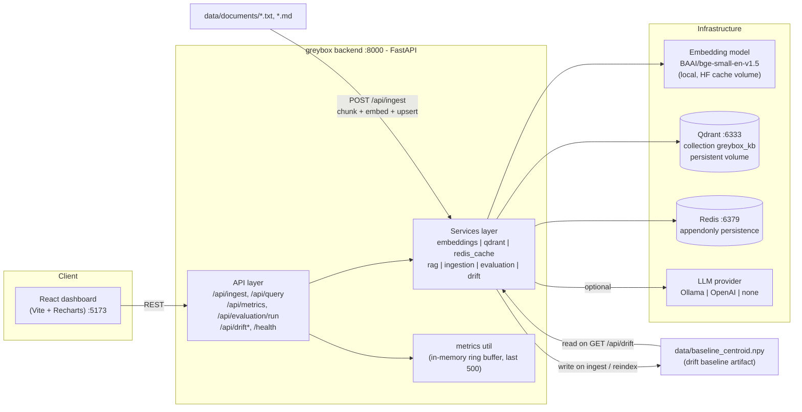

# greybox

RAG retrieval reliability & observability platform (MVP).

## 1. Project overview

greybox is a Retrieval-Augmented Generation system built to demonstrate RAG
**infrastructure and observability**, not to be a chatbot. The interesting parts
are everything around the LLM call:

- **Local embeddings** via `sentence-transformers` (`BAAI/bge-small-en-v1.5`,
  384-dim) — no paid embedding APIs.
- **Qdrant** cosine vector search over deterministically chunked documents.
- **Redis** query caching with configurable TTL and hit/miss counters.
- **Latency observability**: per-request breakdown (embedding / Qdrant / LLM)
  plus p50/p95/p99 percentiles over a rolling window.
- **Retrieval-quality evaluation**: Hit@5 against a ground-truth question set,
  no LLM in the loop.
- **Embedding-drift detection**: corpus-centroid cosine drift vs. a saved
  baseline, with a synchronous auto-reindex trigger past a threshold.
- **React dashboard** (Vite + Recharts) visualizing all of the above.

The LLM is optional and best-effort. With no Ollama/OpenAI backend configured,
queries still return ranked chunks and scores with `answer: null` — retrieval
never fails because generation is down.

## 2. Architecture diagram



## 3. Why RAG observability matters

- **Retrieval quality dominates end-to-end quality.** If the right chunk is not
  in the top-k, prompt engineering and model choice cannot recover the answer.
  Measuring retrieval directly (Hit@5) isolates the failure mode that
  generation metrics hide.
- **Retrieval degrades silently.** A bad index, wrong collection, dimension
  mismatch, or empty corpus still returns *something* with a plausible score.
  Without ground-truth eval and health checks, regressions look like normal
  operation.
- **Embedding, model, and corpus drift.** Swapping or upgrading the embedding
  model, or letting the corpus shift topically, moves vectors relative to a
  fixed query distribution. greybox tracks a corpus centroid against a saved
  baseline so the shift is a number.
- **Cache economics.** A query cache trades staleness for latency and cost. You
  cannot reason about that trade without hit rate, TTL, and cached-vs-uncached
  latency visible.
- **Ground-truth evaluation is non-optional.** "It seems better" cannot gate a
  deploy. A fixed question set with known-relevant sources gives a repeatable
  score.

## 4. Architecture

### API layer (`backend/app/api/routes/`)

Thin FastAPI routers, one module per concern: `ingestion` (`/api/ingest`),
`query` (`/api/query`, `/api/metrics`), `evaluation` (`/api/evaluation/run`),
`drift` (`/api/drift`, `/api/drift/simulate`, `/api/drift/check`), and `health`
(`/health`). Routers validate with Pydantic v2 schemas
(`backend/app/models/schemas.py`) and delegate all work to the services layer.
The embedding model is warmed up in the FastAPI `lifespan` hook, and the Qdrant
collection is created if missing at startup.

### Services layer (`backend/app/services/`)

- **`embeddings.py`** — wraps the `sentence-transformers` model. Loads once;
  exposes `warmup()`, `get_dimension()`, batch encoding. Deterministic (same
  text -> same vector). Model set by `GREYBOX_EMBEDDING_MODEL`.
- **`qdrant.py`** — collection lifecycle and cosine search. Maps hits to the
  internal `RetrievedChunk` shape (`score`, `source`, `content`, `document_id`,
  `chunk_id`). Raises a typed `QdrantUnavailable` instead of leaking client
  errors.
- **`redis_cache.py`** — string-keyed query cache: key derivation, TTL writes,
  and the in-memory `cache_hits` / `cache_misses` counters.
- **`rag.py`** — answer generation only. Builds the grounded prompt from the
  retrieved chunks and dispatches to the configured LLM provider (`ollama` /
  `openai` / `none`), returning `(answer, error_message)` and degrading to
  `answer: null` on any failure. The query pipeline itself (normalize -> cache
  lookup -> embed -> Qdrant search -> top-k -> `rag.generate_answer` -> cache
  write -> return, timing each stage) lives in `api/routes/query.py`.
- **`ingestion.py`** — reads `.txt` / `.md`, word-based deterministic chunking,
  local embedding, upsert to Qdrant with deterministic UUIDv5 point IDs, then
  recompute and save the baseline drift centroid.
- **`evaluation.py`** — loads the ground-truth question set, embeds each
  question, runs a top-5 search, counts a hit when any relevant source appears.
  No LLM.
- **`drift.py`** — computes the current corpus centroid, compares to the saved
  baseline via cosine, and (for `/api/drift/check`) synchronously triggers a
  full reindex when drift exceeds the threshold.

### Metrics util (`backend/app/utils/metrics.py`)

Process-local. A `deque(maxlen=500)` ring buffer of recent requests plus a
`total_queries` counter, guarded by a lock. Percentiles use the **nearest-rank**
method (pick the value at the computed rank), not averaging. `snapshot()` merges
in the cache counters to produce the `/api/metrics` payload. Everything here is
lost on restart.

## 5. Tech stack

| Area | Choice |
| --- | --- |
| Language | Python 3.12 |
| API framework | FastAPI 0.115, Uvicorn |
| Config | Pydantic v2 + pydantic-settings (`GREYBOX_` env prefix) |
| Vector DB | Qdrant 1.12 (`qdrant-client`) |
| Cache | Redis 7 (`redis-py`) |
| Embeddings | `sentence-transformers` — `BAAI/bge-small-en-v1.5`, 384-dim |
| Numerics | NumPy |
| HTTP client | httpx (LLM provider calls) |
| LLM (optional) | Ollama (default) or OpenAI, or disabled |
| Tests | pytest, pytest-asyncio, fakeredis |
| Dashboard | React + Vite + Recharts |
| Orchestration | Docker Compose |

No paid embedding APIs are used anywhere.

## 6. Local setup

Prerequisites: Docker + Docker Compose.

```bash
cp .env.example .env      # adjust if needed; all vars are GREYBOX_*
docker compose up --build # or: make up
```

Services:

| Service | URL |
| --- | --- |
| Backend API + Swagger docs | http://localhost:8000/docs |
| Dashboard | http://localhost:5173 |
| Qdrant | http://localhost:6333 |
| Redis | localhost:6379 |

**First boot downloads the embedding model** (~130 MB) into the `hf_cache`
Docker volume. That download happens once; subsequent starts reuse the cached
model. The backend logs `embedding model ready (dim=384)` when it is available.

### Configuration reference

All environment variables are prefixed `GREYBOX_` (see `.env.example`).

| Variable | Default | Purpose |
| --- | --- | --- |
| `GREYBOX_QDRANT_URL` | `http://qdrant:6333` | Qdrant endpoint |
| `GREYBOX_REDIS_URL` | `redis://redis:6379` | Redis endpoint |
| `GREYBOX_QDRANT_COLLECTION` | `greybox_kb` | Vector collection name |
| `GREYBOX_EMBEDDING_MODEL` | `BAAI/bge-small-en-v1.5` | sentence-transformers model id |
| `GREYBOX_CACHE_TTL_SECONDS` | `3600` | Query cache TTL |
| `GREYBOX_DRIFT_THRESHOLD` | `0.15` | Drift score above which reindex triggers |
| `GREYBOX_CHUNK_SIZE` | `500` | Chunk window size, in words |
| `GREYBOX_CHUNK_OVERLAP` | `100` | Chunk overlap, in words |
| `GREYBOX_DATA_DIR` | `/data` | Root of documents + evaluation + baseline artifact |
| `GREYBOX_BASELINE_CENTROID_PATH` | `/data/baseline_centroid.npy` | Drift baseline artifact path |
| `GREYBOX_LLM_PROVIDER` | `ollama` | `ollama` \| `openai` \| `none` |
| `GREYBOX_OLLAMA_URL` | `http://host.docker.internal:11434` | Ollama base URL |
| `GREYBOX_OLLAMA_MODEL` | `llama3.2` | Ollama model |
| `GREYBOX_OPENAI_API_KEY` | (empty) | OpenAI key, if provider is `openai` |
| `GREYBOX_OPENAI_MODEL` | `gpt-4o-mini` | OpenAI model |

## 7. How to ingest documents

Put `.txt` or `.md` files in `data/documents/` (the repo ships a small seed
knowledge base about RAG, Qdrant, Redis, embeddings, FastAPI, vector search, and
observability). Then:

```bash
curl -s -X POST http://localhost:8000/api/ingest | python3 -m json.tool
# or: make ingest
```

What ingestion does:

1. Read every `.txt` / `.md` under `data/documents/`.
2. Deterministic **word-based** chunking: 500-word windows with 100-word
   overlap. Words are treated as an approximation of tokens (a known
   simplification — see limitations).
3. Embed each chunk locally with the configured model.
4. Upsert to Qdrant with deterministic **UUIDv5** point IDs, so re-ingesting the
   same content overwrites rather than duplicates. Each point's payload:
   `document_id`, `source`, `chunk_id`, `content`, `content_hash`, `version`.
5. Recompute the corpus centroid and save it to
   `data/baseline_centroid.npy` — this becomes the drift baseline.

Response:

```json
{
  "documents_processed": 7,
  "chunks_created": 18,
  "collection": "greybox_kb"
}
```

## 8. How to query

```bash
curl -s -X POST http://localhost:8000/api/query \
  -H 'content-type: application/json' \
  -d '{"query": "How does Redis key expiration work?", "top_k": 5}' \
  | python3 -m json.tool
```

Pipeline: normalize the query text -> look it up in Redis
(`greybox:query:<sha256(normalized_query)>`) -> on hit, return the cached
payload -> on miss, embed locally -> Qdrant cosine search -> take top-k chunks ->
optionally ask the configured LLM for an answer -> write the result to Redis with
the configured TTL -> return.

Response shape:

```json
{
  "query": "How does Redis key expiration work?",
  "answer": "Redis expires keys using a mix of lazy and active expiration ...",
  "message": null,
  "cache_hit": false,
  "latency_ms": 42.7,
  "latency": {
    "embedding_latency_ms": 11.3,
    "qdrant_latency_ms": 6.4,
    "llm_latency_ms": 24.9,
    "total_latency_ms": 42.7
  },
  "results": [
    { "score": 0.83, "source": "redis.md", "content": "Keys can be given a time to live ..." },
    { "score": 0.71, "source": "redis.md", "content": "Active expiration samples keys ..." }
  ]
}
```

If no LLM backend is reachable, `answer` is `null`, `message` explains why
(e.g. `"LLM unavailable"`), and `results` is still fully populated. **The
retrieval request never fails just because the LLM is down.**

## 9. How caching works

- **Key derivation.** The query string is normalized (trimmed, lowercased,
  whitespace-collapsed), hashed with SHA-256, and prefixed:
  `greybox:query:<sha256(normalized_query)>`. Two queries that differ only in
  casing or spacing share a cache entry.
- **Storage.** A single Redis string value per key, holding the `answer`, the
  `results` list, their `scores`, and a `timestamp`.
- **TTL.** Every write sets `GREYBOX_CACHE_TTL_SECONDS` (default 3600s). Expiry
  is left entirely to Redis.
- **Counters.** `cache_hits` and `cache_misses` are incremented in process
  memory only. They are **not** persisted and reset on restart. `cache_hit_rate`
  in `/api/metrics` is derived from them.
- **Invalidation.** There is none beyond TTL. Re-ingesting documents does not
  purge the cache; stale entries age out on their own.

## 10. How Hit@5 works

`POST /api/evaluation/run` measures retrieval quality only — no LLM is involved.

1. Load `data/evaluation/questions.json` — 28 ground-truth questions, each with a
   `relevant_sources` list (e.g. `["qdrant.md"]`).
2. Embed each question with the same local model used for ingestion.
3. Run a Qdrant top-5 cosine search.
4. Score a **hit** for a question if *any* of its `relevant_sources` appears
   among the 5 retrieved chunks' sources.
5. `hit_at_5 = hits / total_questions`.

Response:

```json
{
  "total_questions": 28,
  "hits": 28,
  "hit_at_5": 1.0,
  "results": [
    { "question": "What are collections in Qdrant ...",
      "hit": true,
      "retrieved_sources": ["qdrant.md", "qdrant.md", "vector-search.md", "rag.md", "embeddings.md"] }
  ]
}
```

The seed set is deliberately easy (each question has an obvious source), so a
correctly wired system scores at or near `1.0` on it — it is a smoke test for the
retrieval path, not a difficulty benchmark. Run history is kept in memory for the
life of the process only.

## 11. How drift detection works

`GET /api/drift` answers: has the embedded corpus moved away from where it was
at the last ingest/reindex?

- Reduce the entire indexed corpus to a single **centroid**: the mean of all
  chunk embeddings, L2-normalized.
- Compare against the baseline centroid saved at the last ingest
  (`data/baseline_centroid.npy`).
- `drift_score = 1 - cosine_similarity(baseline_centroid, current_centroid)`.
  0.0 means identical direction; larger means more divergence.
- `drift_detected = drift_score > GREYBOX_DRIFT_THRESHOLD` (default `0.15`).

```json
{ "drift_score": 0.021, "threshold": 0.15, "drift_detected": false, "baseline": true }
```

The threshold is an **operational knob**, not a scientifically derived or
optimal value. Pick it based on how much corpus movement you are willing to
tolerate before paying for a reindex.

### Drift simulation (`POST /api/drift/simulate`)

A **demonstration aid**, not a realistic drift generator. It writes several
markdown files of deliberately off-topic content (alpine beekeeping, cave-aged
cheese, salt-marsh ecology, hand-weaving, falconry — nothing to do with the
knowledge base) into `data/documents/` and re-ingests **without** updating the
baseline centroid. That is enough off-distribution mass to push `drift_score`
above the default `0.15` threshold, so a subsequent `GET /api/drift` reports
`drift_detected: true` and `POST /api/drift/check` performs a reindex.

Example, measured on the seed corpus (7 docs / 18 chunks):

```
GET  /api/drift            -> drift_score 0.004  drift_detected false
POST /api/drift/simulate   -> chunks_added 40
GET  /api/drift            -> drift_score 0.194  drift_detected true
POST /api/drift/check      -> action "reindex_triggered"
GET  /api/drift            -> drift_score 0.000  drift_detected false
```

The reindex folds the off-topic files into the new baseline; delete the
`_drift_sim_*.md` files and re-ingest to return to the original corpus.

## 12. How automatic re-indexing works

`POST /api/drift/check`:

1. Compute the current drift score exactly as `GET /api/drift` does.
2. If `drift_score > threshold`: synchronously re-run full ingestion
   (re-embed every document, re-upsert to Qdrant), recompute the baseline
   centroid, and save it. Return:

   ```json
   { "drift_detected": true, "drift_score": 0.19, "action": "reindex_triggered" }
   ```

3. Otherwise return `{ "drift_detected": false, "drift_score": 0.02, "action": "none" }`.

There is **no Celery / job queue**. The reindex runs inline and blocks the HTTP
request until it completes. This is deliberate for the MVP and is only
acceptable because the seed corpus is tiny.

## 13. API endpoints

| Method | Path | Purpose |
| --- | --- | --- |
| `GET` | `/health` | App + Qdrant (`get_collections`) + Redis (`ping`) health; returns `healthy` or `degraded` |
| `POST` | `/api/ingest` | Chunk, embed, and upsert `data/documents/`; recompute and save the drift baseline centroid |
| `POST` | `/api/query` | Cached retrieval (+ optional LLM answer); returns chunks, scores, `cache_hit`, latency breakdown |
| `GET` | `/api/metrics` | Query counts, cache hit rate, p50/p95/p99 latency, recent-request series for charting |
| `POST` | `/api/evaluation/run` | Run Hit@5 over the ground-truth question set (no LLM) |
| `GET` | `/api/drift` | Current corpus-centroid drift score vs. baseline |
| `POST` | `/api/drift/simulate` | Demo: inject an off-topic doc and re-ingest without updating the baseline |
| `POST` | `/api/drift/check` | Compute drift; synchronously reindex if over threshold |

No endpoint has authentication.

## 14. Running tests

```bash
make test
# runs: docker compose run --rm --no-deps backend pytest -q
```

The suite runs **inside the backend image** because it needs `torch` (pulled in
by `sentence-transformers`). External dependencies are faked, not mocked at the
network layer:

- a fake embedding model (fixed dimension, deterministic vectors),
- `fakeredis` for the cache,
- a mocked Qdrant client.

Coverage (`backend/tests/`):

| File | What it checks |
| --- | --- |
| `test_embeddings.py` | Embedding dimension and determinism |
| `test_chunking.py` | Word-window chunking, overlap, empty-document handling |
| `test_cache.py` | Cache miss then hit, key normalization |
| `test_retrieval.py` | Qdrant hit -> `RetrievedChunk` payload mapping |
| `test_evaluation.py` | Hit@5 counting math |
| `test_drift.py` | Centroid computation and cosine drift-score math |
| `test_api.py` | `/health`, `/api/query`, `/api/metrics` HTTP behavior |

### Makefile targets

`up`, `down`, `logs`, `build`, `test`, `ingest`, `query` (override with
`Q="..."`), `evaluate`, `drift`, `drift-simulate`, `drift-check`, `reindex`,
`metrics`.

## 15. Example metrics

> **Every number below is an illustrative example to show the response shape.**
> These are **not** measured benchmarks and were not produced by running the
> system. Do not cite them as results.

`GET /api/metrics`:

```json
{
  "total_queries": 120,
  "cache_hits": 46,
  "cache_misses": 74,
  "cache_hit_rate": 0.3833,
  "latency": {
    "p50": 38.1,
    "p95": 91.4,
    "p99": 140.7
  },
  "recent": [
    { "total_latency_ms": 44.2, "ts": 1756500000.12, "cache_hit": false },
    { "total_latency_ms": 3.1,  "ts": 1756500001.34, "cache_hit": true },
    { "total_latency_ms": 39.7, "ts": 1756500002.51, "cache_hit": false }
  ]
}
```

How to read it: `latency` percentiles are nearest-rank over the last 500
requests (a cache hit shows a very low `total_latency_ms` — it skips embedding,
Qdrant, and the LLM); `cache_hit_rate = cache_hits / (cache_hits +
cache_misses)`. The whole payload is process-local and resets on restart.

## 16. Known limitations

- **Chunking counts words, not tokens.** 500-word / 100-word-overlap windows
  approximate token windows; real token counts differ per tokenizer.
- **Metrics and cache counters are in-memory and single-process.** They reset on
  restart and are wrong under multiple backend replicas.
- **Drift detection is a single global centroid.** It is coarse: it will not
  catch localized topic drift within an otherwise stable corpus, and it behaves
  poorly on multi-modal / multi-topic corpora where the mean is not
  representative.
- **The drift threshold is arbitrary.** `0.15` is an operational default, not a
  value derived from data or statistical testing.
- **`/api/drift/simulate` is a demo aid.** It injects fixed off-topic filler
  text; it is not a realistic model of how production corpora drift.
- **Re-indexing is synchronous** and blocks the triggering request. Acceptable
  only for a small corpus.
- **No authentication or rate limiting** on any endpoint.
- **LLM answers are best-effort.** With no Ollama/OpenAI configured, `answer` is
  always `null` (retrieval still works).
- **Hit@5 quality is bounded by the seed dataset.** 28 questions over 7 seed
  documents is a smoke test, not a rigorous benchmark.

## 17. Future improvements

- Persistent metrics store (Postgres / ClickHouse) with Grafana dashboards, in
  place of the in-memory ring buffer.
- Real tokenizer-based chunking (match the embedding model's tokenizer).
- Async / background re-indexing behind a job queue instead of blocking the
  request.
- Hybrid retrieval (dense + sparse / BM25) plus a re-ranking stage.
- Additional retrieval metrics: MRR, recall@k, nDCG alongside Hit@5.
- Distributional drift detection (MMD, population stability index) and
  per-cluster drift instead of one global centroid.
- Per-document drift attribution — identify *which* documents moved the corpus.
- Authentication and rate limiting on the API.
- CI that runs the test suite on every push.
